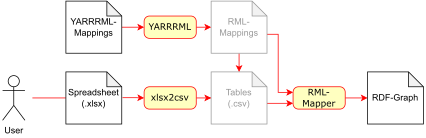

# xlsx2owl

Using a spreadsheet to collect concepts for an ontology benefits from the high number of users interacting with spreadsheet software everyday.
With *xlsx2owl Stahl* domain experts can add and edit concepts in a special spreadsheet structure.
The spreadsheet can easily get translated to a turtle coded owl file with the YARRRML/RML mapping and shell script contained.

## Usage

* build docker image, e.g. via `$ buildah bud -t xlsx2owl-sd ./`
* switch to working directory
* run docker image, e.g. via `$ podman run -it --rm -v "./:/home/user/data" xlsx2owl-sd 'file:///home/user/xlsx2owl-Example.xlsx'`

## Dependencies

* Python 3 (from xlsx2csv)
* Java 1.8 (from RML)
* node.js 14 (from YARRRML)
* bash >=5 (maybe from bash regex)

## Acknowledgement

* YARRRML
* RML
* xlsx2csv
* curl

We want to kindly thank [Sebastian Tramp](https://github.com/seebi) and [eccenca GmbH](https://eccenca.com) for the initial idea, spreadsheet structure and rich input.
